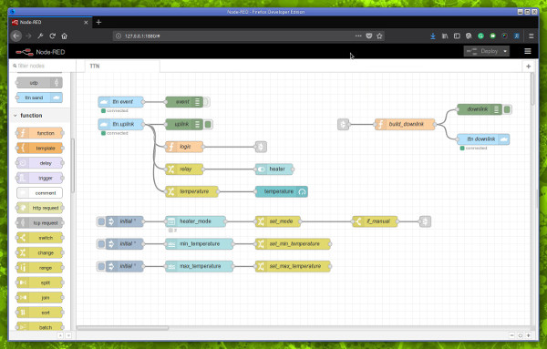
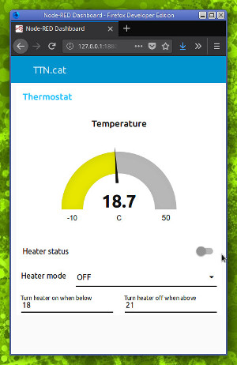

# Termostat TTN.cat


Exemple de comunicació bidireccional sobre TTN.

[](LICENSE)
[](https://twitter.com/intent/follow?screen_name=ttncat)

Aquest repositori conté exemples de connexió bidireccional a TTN
fent servir la lògica d'un termostat com a cas d'ús.

## Hardware

Cada carpeta conté informació sobre el hardware necessari per cada exemple,
així com el firmware específic per cada dispositiu.

## Configuració del *backend* de TTN

#### Configuració bàsica

Crea un nou aplicatiu i un dispositiu en aquest aplicatiu. Selecciona ABP o OTTA i anota les claus generades. Les hauràs d'incloure a l'arxiu `credentials.h` del codi més endavant.

#### Payload parsing

Selecciona la pestanya `Payload Formats` dins de l'aplicatiu i introdueix el següent codi per el `decoder`:

```

function Decoder(bytes, port) {
    var decoded = {};
    if (12 == port) {
        var value = (bytes[0] - 100) + (bytes[1] / 100);
        decoded.temperature = value;
        decoded.relay = (0x31 == bytes[2]);
    }
    return decoded;
}
```

Aquest codi és l'encarregat de parsejar el missatge de manera que el nostre aplicatiu el rebi en forma de paràmetres.

## Aplicatiu Node-RED

La carpeta `node-red` conté un fluxe que gestiona els missatges entrants, aplica la lògica d'un termostat i envia (si cal) un missatge al node amb un canvi d'estat en el relé.

#### Requeriments

El fluxe de Node-RED necessita els següents components: `node-red-contrib-ttn` i `node-red-dashboard`. Es poden instal·lar fent servir la opció `Manage Palette` del menú superior dret de l'interficie de Node-RED.

#### Fluxe

Obre l'arxiu `flow.json` amb un editor de text i copia els continguts. Després fes servir la opció `Import > Clipboard` del menú superior dret de Node-RED per copiar el fluxe a la pestanya actual.



Obre qualsevol dels nodes TTN (ttn-uplink) i al costat del nom de l'aplicatiu clica a l'eina d'edició. En el formulari que apareixerà hauràs de canviar el AppID amb el Application ID de la teva aplicació i l'Access Key amb un amb permissos per missatges i esdeveniments.

Un cop fet això hauries de començar a rebre missatges del node. Visita la pàgina del dashboard (normalment la mateixa URL de Node-RED + "/ui") per veure la temperatura, canviar el mode d'us del relay (ON, OFF or AUTO) o seleccionar el rang de temperatures per el mode AUTO.



## Llicència

Copyright (C) 2018 by Xose Pérez (@xoseperez)
for The Things Network Catalunya

This program is free software: you can redistribute it and/or modify
it under the terms of the GNU General Public License as published by
the Free Software Foundation, either version 3 of the License, or
(at your option) any later version.

This program is distributed in the hope that it will be useful,
but WITHOUT ANY WARRANTY; without even the implied warranty of
MERCHANTABILITY or FITNESS FOR A PARTICULAR PURPOSE.  See the
GNU General Public License for more details.

You should have received a copy of the GNU General Public License
along with this program.  If not, see <http://www.gnu.org/licenses/>.
