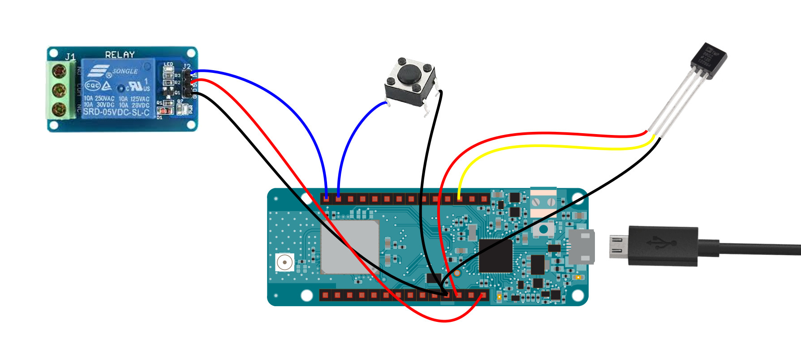

# Termostat amb Arduino MKR WAN 1300

Exemple de comunicació bidireccional sobre TTN amb un Arduino MKR WAN 1300.

Aquest exemple fa servir la llibreria MKRWAN d'Arduino,
disponible des del gestor de llibreries de l'IDE o aquí:
https://github.com/arduino-libraries/MKRWAN

## Hardware

#### Components

* Arduino MKRWAN1300 amb mòdul LoRaWan Murata CMWX1ZZABZ (http://tinkerman.cat/arduino-mkr-wan-1300/)
* Sensor de temperatura analògic TMP35/LM35
* Mòdul de relé
* Botó
* Cables i/o protoboard per fer les connexions

#### Cablejat

## Firmware Arduino

Primer de tot cal carregar a l'IDE d'Arduino el suport per plaques SAMD21 i la llibreria MKRWAN. Es pot fer des de les opcions 'Gestor de targes' i 'Gestor de llibreries'. Aquest pas no és necessari si es fa servir PlatformIO.

Pot ser necessari actualitzar el firmware del STM32 que hi ha dins el mòdul LoRa de Murata. Afortunadament la llibreria MKRWAN bé amb un sketch d'exemple específic per fer això. Només cal que carreguis al MKRWAN1300 l'exemple `MKRWANFWUpdate_standalone`. Un cop fet ober el monitor del port sèrie per veure el procés d'actualització. Quan hagi acabat el mòdul ja estarà preparat per carregar el nostre propip sketch.

El primer que cal fer és configurar les dades per connectar-nos a TTN. Duplica l'arxiu `credentials.sample.h` amb el nom `credentials.h` i edita'l introduint-hi les dades apropiades segons el *backend* the TTN.

Després compila i puja el codi al MKR WAN 1300. Ho pots fer fent servir PlatformIO amb `pio run -t upload` o amb l'IDE d'Arduino.

Per defecte el codi envia un missatge amb la temperatura i l'estat del relé cada 60 segons i espera resposta per canviar l'estat del relé. També es pot forçar l'enviament prement el botó.

Tots els paràmetres de configuració (temps entre missatges, GPIOs dels diferents components...) estan al principi del codi principal (thermostat.ino).
